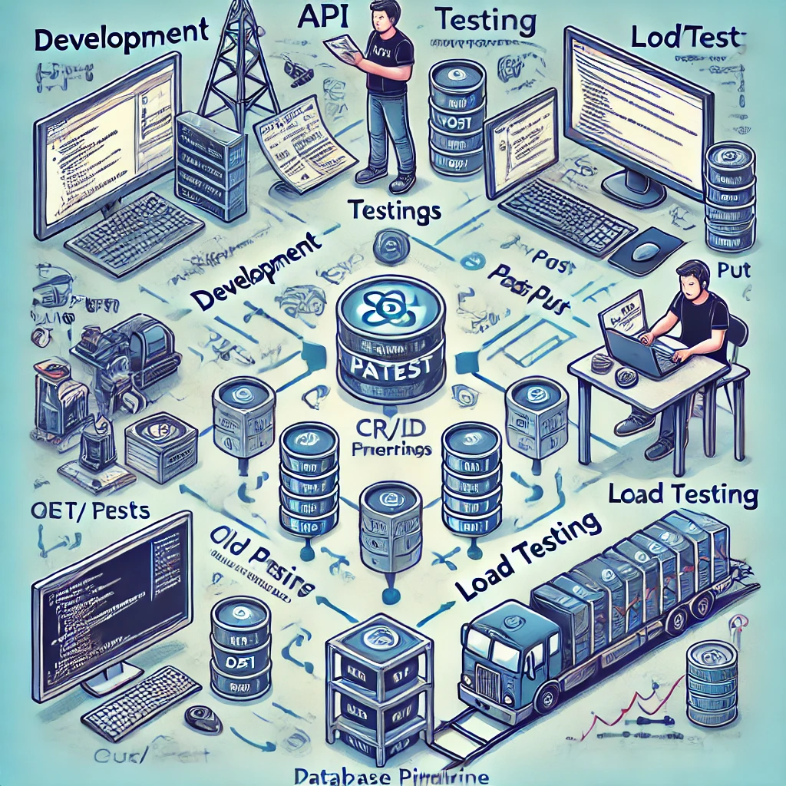
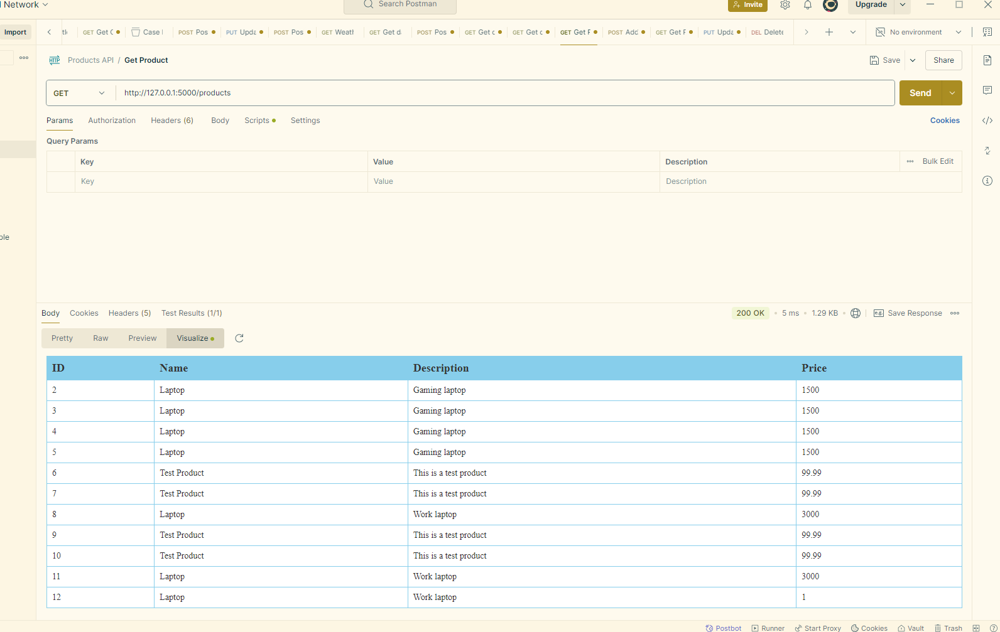
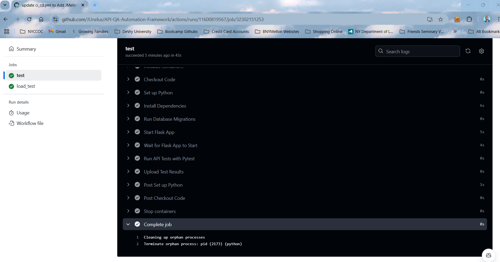

# API QA Automation Framework

This project demonstrates a robust API QA Automation Framework designed for automated testing and load testing of RESTful APIs. It uses Flask for the API, pytest for functional testing, and JMeter for load testing, all integrated with GitHub Actions for CI/CD.

## Project Structure

```
api-testing-framework
├── app.py                # Main Flask application
├── config.py             # Configuration settings
├── models.py             # Database models for API
├── requirements.txt      # Dependencies for the project
├── test_scripts          # Automated test scripts
│   └── test_api.py       # Functional API tests using pytest
├── load_tests            # JMeter load test plans
│   └── load_test_plan.jmx # JMeter test plan for load testing
└── .github
    └── workflows
        └── ci_cd.yml     # CI/CD pipeline with GitHub Actions
```

## Getting Started

### Prerequisites

- Python 3.8+
- PostgreSQL (if using a database other than SQLite)
- JMeter (optional, for local load testing)
- GitHub account for CI/CD


### Installation

1. Clone the repository:
    ```bash
    git clone https://github.com/JUnelus/API-QA-Automation-Framework.git
    cd api-testing-framework
    ```

2. Install dependencies:
    ```bash
    python -m venv venv
    source venv/bin/activate  # On Windows use `venv\Scripts\activate`
    pip install -r requirements.txt
    ```

3. Set up and run the API locally:
    ```bash
    python app.py
    ```
   The API should be available at `http://127.0.0.1:5000`.


### Running Tests

#### 1. Functional Tests with Pytest

Run functional tests to validate API endpoints:

```bash
pytest test_scripts/test_api.py
```

#### 2. Load Tests with JMeter

Run load tests by using JMeter to measure response times and throughput:

```bash
jmeter -n -t load_tests/load_test_plan.jmx -l test_results/jmeter_results.jtl
```

#### 3. CI/CD with GitHub Actions

Push any changes to GitHub to automatically trigger the CI/CD pipeline. The pipeline will:

1. Run the functional tests with pytest.
2. Execute JMeter load tests (if configured).


## Configuration

Edit `config.py` to configure different environments (development, testing, production). Update `DATABASE_URL` for PostgreSQL or other databases as needed.

## Additional Resources

- [Flask Documentation](https://flask.palletsprojects.com/)
- [Pytest Documentation](https://docs.pytest.org/)
- [JMeter Documentation](https://jmeter.apache.org/)